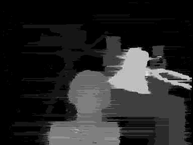

# Final Project - Depth Estimation from Stereo Images
[PDF Report](report/Final%20Project.pdf)   

## Target
- Disparity to Depth
  - Disparity post-processing: Histogram
  - 1 / Disparity
  - normalize result
- Rectified image to Disparity
  - DP method
  - Block Matching
    - Disparity post-processing: Filtering
- image Rectification
  - Points Pair finding
  - build fundamental matrix, build homography matrices, and then wrap images

## Result
- see PDF report
- run `main.py` code
- other experiments result at `report/`

## Reference
1. opencv: findFundamentalMat(), stereoRectifyUncalibrated(), SIFT_create(), warpPerspective()
2. Middlebury dataset: https://vision.middlebury.edu/stereo/data/scenes2001/
3. disparity DP method lecture: https://www.cse.psu.edu/~rtc12/CSE486/lecture09.pdf
4. image rectification: https://www.andreasjakl.com/understand-and-apply-stereo-rectification-for-depth-maps-part-2/
