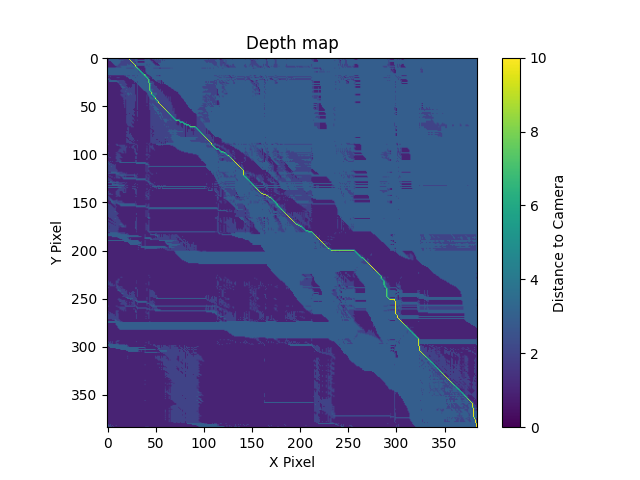

# Report of lots of experiments
- [Experiment: Visualization of DP method](#experiment-visualization-of-dp-method)
- [Experiment: DP method, different occlusion constant value](#experiment-dp-method-different-occlusion-constant-value)
- [Experiment: Histogram post-processing](#experiment-histogram-post-processing)


## Experiment: Visualization of DP method
I choose `tsukuba` dataset, image 0 and 4, at line 100 as example. ( `image[100, :, :]` )
```
Dataset\tsukuba_new\scene1.row3.col1.jpg  
                   \scene1.row3.col5.jpg
```

```python
from datasets import getDataset
dataset = getDataset('tsukuba')
image_l, image_r = dataset[0], dataset[4]
```

x-axis is the 100-row in left image  
y-axis is the 100-row in right image

relation: norm(R1-R2, G1-G2, B1-B2)  
direction: 2 means right down, 1 means right, 3 means down

|relation map|DP map|DP direction map| path in direction map|
|-|-|-|-|
|||||

## Experiment: DP method, different occlusion constant value
```
same image, same line
```

|Occ 10|Occ 20|Occ 30|
|-|-|-|
||||

## Experiment: Histogram post-processing
use Histogram to threshold the lower peak value( often with value: 0 )
which is caused from disparity algorithm error, algorithm limitation, or the border of middlebury disparity map

### Middlebury provided disparity
```
Dataset\tsukuba_new\truedisp.row3.col3.jpg
```

```python
from datasets import getDataset
dataset = getDataset('tsukuba')
disparity = dataset.getDisparity()
```

|before|after|
|-|-|
|||
|||

### Self-calculated disparity
```
calculate disparity from these two images
Dataset\tsukuba_new\scene1.row3.col1.jpg
                   \scene1.row3.col2.jpg
```

```python
from datasets import getDataset
from disparity import getDisparityMap
dataset = getDataset('tsukuba')
image_l, image_r = dataset[0], dataset[1]
disparity = getDisparityMap(image_l, image_r, method='DP')
```

|before|after|
|-|-|
|||
|||
