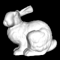
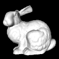
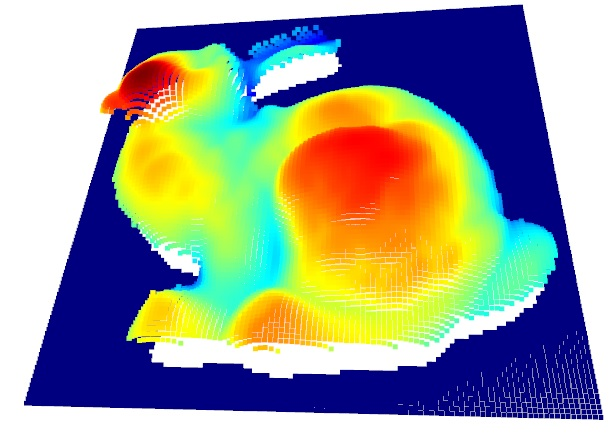
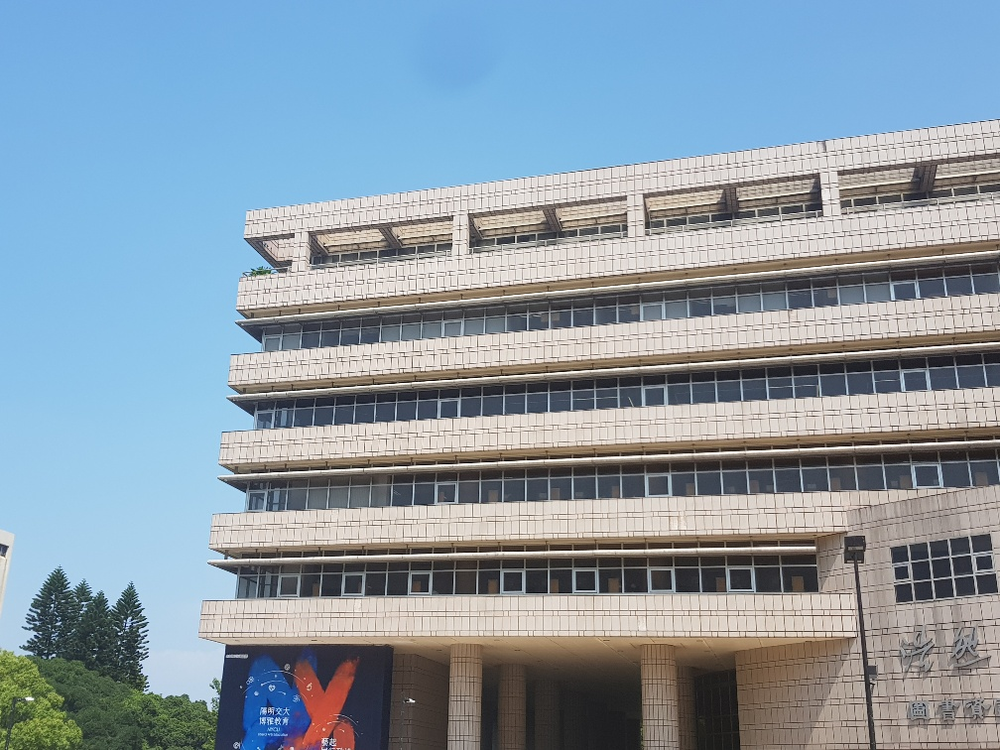
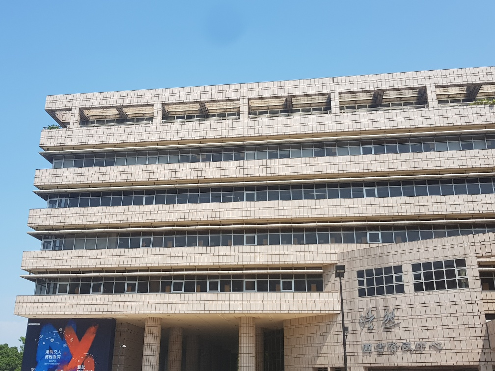
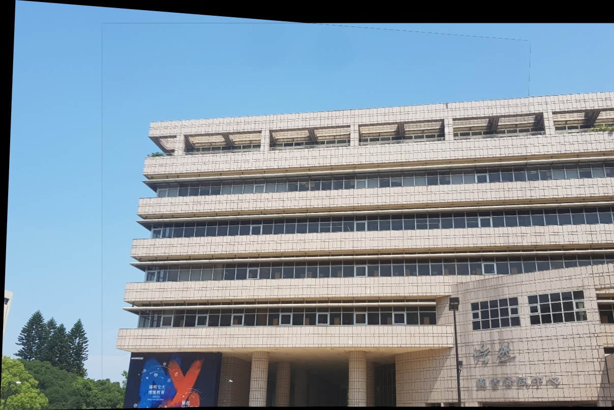

# Course_ComputerVision
電腦視覺(英文授課) Computer Vision, in NCTU

There are 3 homeworks(projects)
- [Course_ComputerVision](#course_computervision)
  - [Environment](#environment)
- [HW1: Photometric Stereo](#hw1-photometric-stereo)
  - [Introduction:](#introduction)
  - [Result:](#result)
  - [Detail:](#detail)
- [HW2: Image Stitching](#hw2-image-stitching)
  - [Introduction:](#introduction-1)
  - [Result:](#result-1)
  - [Detail:](#detail-1)
- [Final Project: Depth Estimation from Stereo Images](#final-project-depth-estimation-from-stereo-images)

## Environment
dependency:  
`python==3.6.13`
```python
matplotlib==3.3.4
numpy==1.19.5
open3d==0.15.1
opencv-python==4.5.5.62
scipy==1.5.4
tqdm==4.63.0
```
maybe that's all(?

# HW1: Photometric Stereo
## Introduction:
Given many image taken(rendered) from **same** viewpoint
with **different** light directions(LightSource.txt).  
Try to estimate the depth(height).

| pic1 | pic2 | pic3 | ... |
|------|------|------|-----|
||||...|

## Result:


## Detail:
Use `Diffuse reflection` method to simulate the image color.  
Calculate it backward to get the height.

$I_{diffuse} = consant * (n \cdot l)$  
$n: \text{normal vector}$  
$l: \text{light direction vector}$

1. Estimate every normal vector in `image[i, j]`.  
   $l = norm(I_{diffuse} \times l_{inv})$  
   $l_{inv}: inverse(l)$
2. Estimate every Gradient vector in (x, y) directions in `image[i, j]`  
   by normal vectors.
3. Estimate the surface height by each Gradient vector.

# HW2: Image Stitching
## Introduction:
Stitching many images
| pic1 | pic2 |
|------|------|
|||

## Result:


## Detail:
1. Use `SIFT` to find features in two images.
2. Find the most similar feature pairs $P(p_i, p_j)\ \forall\ p_i \in I_1$  
   by kNN algorithm(k == 1), and `Lowe's Ratio test`  
   where:  
   $I_1: \text{image1}$  
   $p_i: \text{the location of the features that SIFT find in }I_1$  
   $\text{same as } p_j \text{ to } I_2$  
3. Find the best `Homography Matrix` that transform image 1 to image 2 viewpoints by `RANSAC` algorithm.  
   ```
   RANSAC
   for try_many_times:
       locatoins_of_4_pairs = randomly_get_4_pair()
       matrix = calculate_homography(locatoins_of_4_pairs)

       fit_result = try_fit(matrix, location_of_every_image1_feature)
       score = count_matched(fit_result, location_of_paired_image2_feature, threshold)

       if score > max_score:
           best_matrix = matrix
   ```

# Final Project: Depth Estimation from Stereo Images
Introduction: 
Result: 
Detail: 
